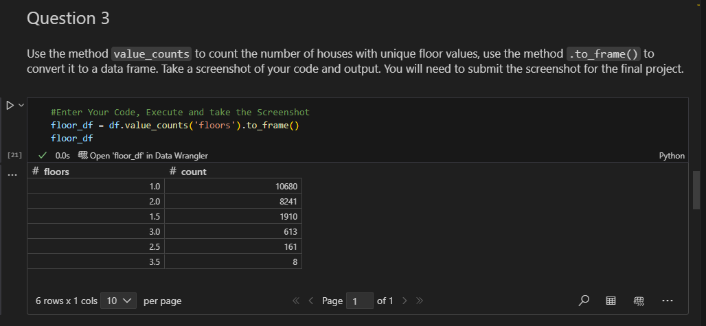
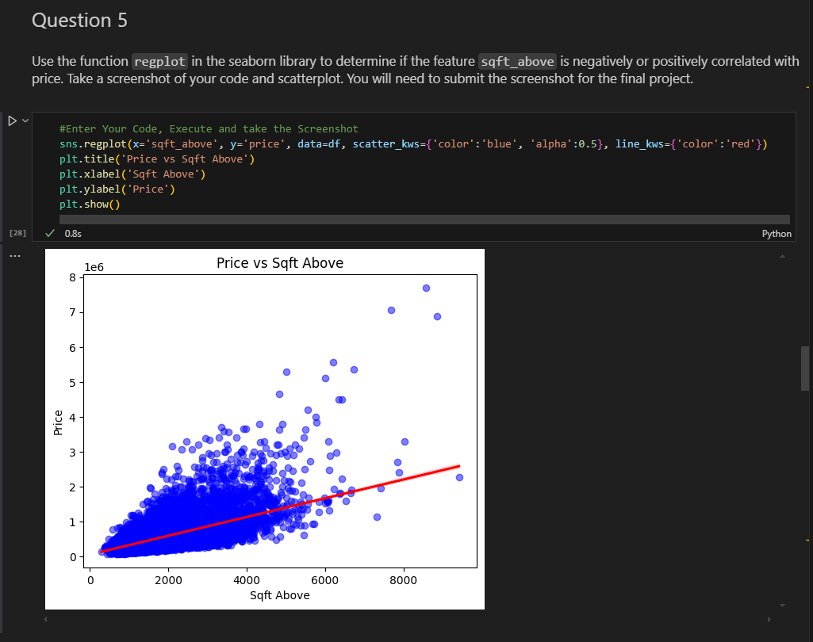

# House Sales in King County, USA Analysis

This repository contains a Jupyter notebook that walks through an end-to-end analysis of residential house sales data in King County, WA (including Seattle). You will import and clean data, explore relationships through visualizations, and build several regression models to predict house prices.

## Repository Structure

- `House_Sales_in_King_Count_USA.ipynb`  
  The main notebook covering:
  - Module 1: Importing Data  
  - Module 2: Data Wrangling  
  - Module 3: Exploratory Data Analysis  
  - Module 4: Model Development  
  - Module 5: Model Evaluation and Refinement  

- `README.md`  
  This file.

## Requirements

- Python 3.7 or higher  
- pandas  
- numpy  
- seaborn  
- matplotlib  
- scikit-learn  

Install dependencies with pip:
```bash
pip install pandas numpy seaborn matplotlib scikit-learn
```

## Usage

1. Clone or download this repository.  
2. Open the notebook `House_Sales_in_King_Count_USA.ipynb` in Jupyter.  
3. Run each cell in order to reproduce the analysis and model results.

## Data Source

The dataset is loaded directly from a public URL:
```
https://cf-courses-data.s3.us.cloud-object-storage.appdomain.cloud/IBMDeveloperSkillsNetwork-DA0101EN-SkillsNetwork/labs/FinalModule_Coursera/data/kc_house_data_NaN.csv
```

## License

© IBM Corporation 2020. All rights reserved.

## Screenshots

Below are the key outputs you should capture in the `images/` directory and reference here:

- **Question 1 – Data Types**  
  

- **Question 2 – Drop Columns**  
  

- **Question 3 – Floor Value Counts**  
  

- **Question 4 – Waterfront Boxplot**  
  

- **Question 5 – Sqft Above Regression**  
  

- **Question 6 – Sqft Living Linear Model**  
  

- **Question 7 – Multi-feature Regression**  
  

- **Question 8 – Pipeline R² Score**  
  

- **Question 9 – Ridge Regression**  
  

- **Question 10 – Polynomial Ridge Regression**  
  
